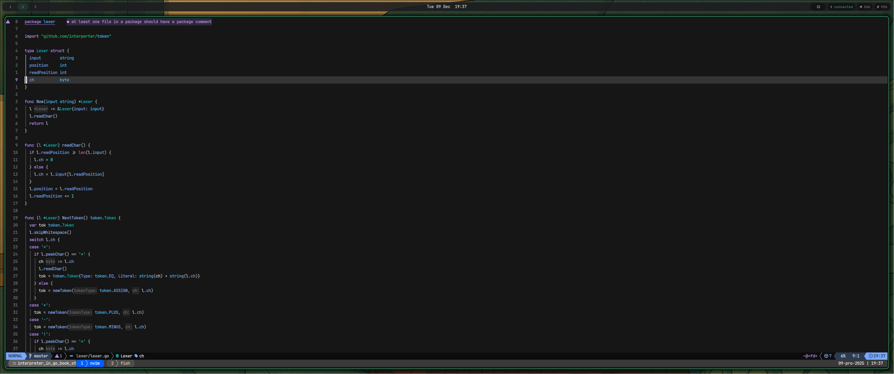

# My Dotfiles

These are the dotfiles I use across all of my systems. The setup works on any Linux distribution and macOS, as long as all required programs are installed.

My tmux configuration should work out of the box if you have Nerd Fonts installed (I use **Hack Nerd Font**). I keep my older tmux powerline and status line configuration as well, since those still work perfectly fine.

## Required Programs

1. [Kitty](https://github.com/kovidgoyal/kitty) – Terminal emulator
2. [tmux](https://github.com/tmux/tmux) – Terminal multiplexer
3. [fish-shell](https://fishshell.com/) – Required for the full setup to work out of the box
4. [fisher](https://github.com/jorgebucaran/fisher) – Used for installing the [Tide](https://github.com/IlanCosman/tide) theme and extensions like `nvm`
5. [git](https://git-scm.com/) – Usually included in most distributions
6. [eza](https://github.com/eza-community/eza) – A modern replacement for `ls` (install with icons for best appearance)
7. [neovim](https://neovim.io/) – Editor
8. [Nerd Fonts](https://github.com/ryanoasis/nerd-fonts) – I use **JetBrains Mono Nerd Font**
9. [Wofi](https://github.com/SimplyCEO/wofi) – Modern application launcher (`drun`)
10. [LazyVim](https://www.lazyvim.org/) – My current Neovim distribution
11. [Waybar](https://github.com/Alexays/Waybar) – Status bar

---

# Installation

To use my dotfiles, copy the repository’s directory structure directly into your `~/.config` folder.

---

# Neovim Setup

Vimscript became increasingly difficult to maintain over time, and with Neovim introducing built-in Lua, configuration became significantly cleaner and more enjoyable.

As of **2023-11-10**, I switched to the **LazyVim** distribution, which currently covers all of my needs. I may adjust the configuration in the future, but for now I’m fully satisfied with it.

LazyVim comes with several themes included; I’m currently using **Tokyo Night**, created by the same author.

---

# Notice

This setup is used across all of my machines.  
My main workstation:

- **Manjaro KDE**, running **Hyprland**
- Lenovo ThinkPad E14
  - AMD Ryzen 7 7735HS
  - Radeon 680M graphics
  - 32 GB RAM
  - 1 TB SSD

My preferred Linux stack:

- Manjaro (KDE or GNOME)
- Hyprland

I do not use this setup on Windows, nor do I plan to.  
I rely on it both professionally and for hobby projects, so yes—it's fully suitable for professional use.

---

# Issues

This configuration works reliably on my systems, but issues may still occur.  
If you encounter any problems, feel free to open an issue.  
Enjoy the setup!
